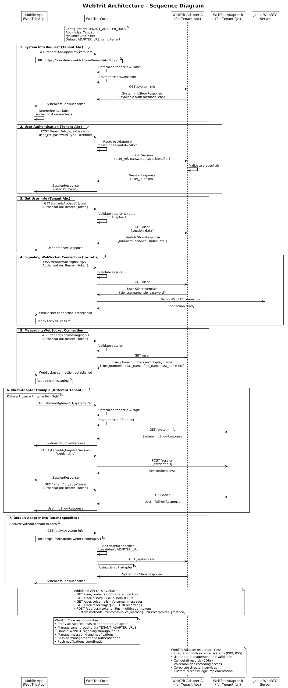

# WebTrit Architecture

*Bridging the web and telecom stacks*

WebTrit is a protocol translation layer. It takes complex VoIP/telecom protocols and abstracts them into clean, simple developer APIs, allowing for seamless integration with existing telecom infrastructure.


<!--
Exported from [draw.io diagram](diagrams/WebTritSystem_Architecture.drawio) to PNG with `Zoom: 200%` and `Border Width: 10`.
/Applications/draw.io.app/Contents/MacOS/draw.io -x -f png -s 2 -b 10 -o WebTritSystem_Architecture.png WebTritSystem_Architecture.drawio
-->

## Core Components

*The WebTrit stack consists of specialized services that handle different aspects of communication*

### WebTrit Core (Elixir/Phoenix)
Central orchestrator managing all business logic and client communication

- **Dual interfaces**: Developer-friendly APIs for apps + complex VoIP protocols for telecom systems
- **Real-time signaling**: WebSocket-based protocol (WTSP) for instant call state updates
- **Multi-tenant architecture**: Single deployment serves multiple organizations
- **Session management**: Handles user authentication, routing, and state coordination

### WebTrit Janus (WebRTC Server)
Media gateway converting between modern web standards and traditional telecom protocols

- **Protocol translation**: WebRTC (browsers/mobile) ↔ SIP (telecom systems)
- **Media handling**: Audio/video streams, network traversal (NAT/firewall)
- **Security**: SRTP & DTLS encryption for all media traffic
- **Scalability**: Multiple instances can be deployed across regions

### Subscriber Data Adapter
Translation microservice connecting WebTrit to existing VoIP and billing systems

- **Standardized interface**: WebTrit uses consistent API regardless of backend system
- **Flexible backends**: Works with PortaSwitch, 3CX, BroadSoft, Asterisk, FreePBX, custom systems
- **Multi-system support**: Different adapters per tenant in same deployment
- **Zero migration**: Integrates with existing user databases and configurations

### Supporting Infrastructure

**Database (PostgreSQL)**
- Session data and configuration storage
- Multi-tenant data isolation
- High-availability clustering support

## Call Session Walkthrough

*Step-by-step flow showing how WebTrit connects calls from mobile apps to traditional phone systems*



### 1. System Initialization
```
Mobile App → WebTrit Core → Adapter → VoIP System
```

- App requests system configuration for tenant
- Core routes request to appropriate adapter based on domain/tenant ID
- Adapter fetches settings from VoIP system (extensions, features, routing rules)
- System info returned to app for local configuration

### 2. User Authentication
```
App → Core → Adapter → VoIP System → Validate → Return User Data
```

- User enters credentials in mobile app
- Core validates session and routes to tenant's adapter
- Adapter authenticates against existing VoIP system user database
- User profile returned (balance, extensions, permissions, contacts)
- **No user migration required** - works with existing accounts

### 3. WebRTC Connection Setup
```
App ←→ Core (WebSocket) ←→ Janus WebRTC Server
```

- Real-time bi-directional WebSocket connection established
- App uses simple WTSP protocol commands
- Janus handles complex WebRTC negotiation (ICE, STUN, TURN)
- Media channels prepared for incoming/outgoing calls

### 4. Call Initiation and Media Flow
```
Mobile App → Core → Janus → SIP Infrastructure → Destination
```

- App sends simple "make call" request via WTSP
- Core validates permissions and routes call
- Janus converts WebRTC media streams to SIP/RTP
- Call integrates with existing routing, billing, and telecom features
- Real-time status updates sent back to app via WebSocket

## Production Deployment

*Scalable, multi-tenant deployment architecture designed for telecom-grade reliability*


<!--
Exported from [draw.io diagram](diagrams/WebTritSystem_Deployment.drawio) to PNG with `Zoom: 200%` and `Border Width: 10`.
/Applications/draw.io.app/Contents/MacOS/draw.io -x -f png -s 2 -b 10 -o WebTritSystem_Deployment.png WebTritSystem_Deployment.drawio
-->

### Frontend Layer
**WebTrit Proxy**
- Load balancing and SSL termination
- Virtual host configuration for multi-tenant deployments
- Can use nginx, Apache, or any HTTP server
- Handles static content and API routing

### Application Layer
**Backend Services**
- **WebTrit Core**: Main application logic and signaling
- **WebTrit Dialer**: Browser-based calling interface
- **WebTrit Janus**: Media server instances (can be distributed)
- **Gorush**: Push notification coordination

**Database Services**
- PostgreSQL primary and replica instances
- Session data, configuration, and tenant isolation
- High-availability clustering options

### Integration Layer
**External Services**
- **Push notifications**: Apple APNs, Google FCM integration
- **VoIP systems**: Multiple concurrent connections via adapter pattern
- **Billing platforms**: Real-time usage tracking and CDR generation

## System Architecture Benefits

*Why this design works better than traditional softphone approaches*

### For Developers
**Simplified development experience**
- **No VoIP expertise required**: Abstract away SIP, SDP, RTP complexity
- **Modern web APIs**: RESTful endpoints and WebSocket signaling
- **Unified interface**: Same client code works with any backend VoIP system
- **Rich documentation**: Clear examples without telecom jargon

### For Telecom Operators
**Seamless integration with existing infrastructure**
- **Zero migration effort**: Works with current user databases and PBX systems
- **Multi-system support**: Integrate different VoIP platforms simultaneously
- **Preserve investments**: Leverage existing telecom infrastructure and licenses
- **Gradual modernization**: Add web/mobile capabilities without replacing core systems

### For System Administrators
**Enterprise-ready deployment and management**
- **Containerized architecture**: Kubernetes-ready for modern DevOps workflows
- **Built-in monitoring**: Admin interfaces, metrics, and logging
- **Flexible hosting**: Self-hosted, cloud, or hybrid deployment options
- **Horizontal scaling**: Add capacity by scaling individual components

## The Translation Layer

*How WebTrit converts between simple developer APIs and complex telecom protocols*

### Client Side: Modern Web APIs
```javascript
// What developers write
webtritClient.makeCall({ to: "+1234567890" })
webtritClient.onCallStateChanged(state => {
  console.log("Call status:", state)
})
```

### Telecom Side: Complex VoIP Protocols
```
// What WebTrit handles automatically
- SIP INVITE/ACK/BYE message sequences
- SDP offer/answer negotiation
- RTP/RTCP media stream management
- NAT traversal (STUN/TURN/ICE)
- Codec negotiation and transcoding
- CDR generation and billing integration
```

### The Magic
WebTrit acts as a **protocol translator and complexity absorber**, enabling developers to build modern communication apps using familiar web technologies while seamlessly connecting to battle-tested enterprise telecom systems.

**Result**: You get the reliability and features of traditional telecom infrastructure with the development speed and flexibility of modern web platforms.
